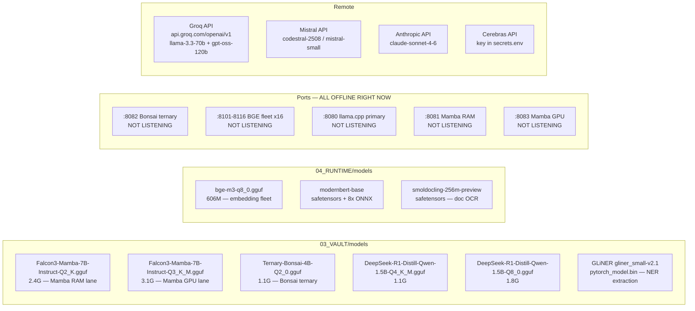

# LUCIDOTA FULL SYSTEM MAP
_Generated 2026-05-30 — full-depth scan, no filtering_

---

## CORRECTIONS

**1. YOUR MODELS ARE NOT MISSING. The first scan was scoped wrong. They're in subdirectories.**
```
03_VAULT/models/tensorblock/Falcon3-Mamba-7B-Instruct-GGUF/
  Falcon3-Mamba-7B-Instruct-Q2_K.gguf        2.4G   ← your "Mamba RAM" lane
  Falcon3-Mamba-7B-Instruct-Q3_K_M.gguf      3.1G

03_VAULT/models/prism-ml/Ternary-Bonsai-4B-gguf/
  Ternary-Bonsai-4B-Q2_0.gguf                1.1G   ← your bonsai ternary

03_VAULT/models/bartowski/DeepSeek-R1-Distill-Qwen-1.5B-GGUF/
  DeepSeek-R1-Distill-Qwen-1.5B-Q8_0.gguf   1.8G
03_VAULT/models/
  DeepSeek-R1-Distill-Qwen-1.5B-Q4_K_M.gguf 1.1G

04_RUNTIME/models/
  bge-m3-q8_0.gguf                           606M   ← BGE fleet
  modernbert-base/model.safetensors                 ← ModernBERT
  smoldocling-256m-preview/model.safetensors        ← SmolDocling
  modernbert-base/onnx/  (8 quantized variants)

03_VAULT/models/gliner/urchade_gliner_small-v2.1/
  pytorch_model.bin                                 ← GLiNER NER

~/.cache/huggingface/hub/
  models--BAAI--bge-m3
  models--answerdotai--ModernBERT-base
  models--bartowski--DeepSeek-R1-Distill-Qwen-1.5B-GGUF
  models--ds4sd--SmolDocling-256M-preview
  models--microsoft--deberta-v3-small
  models--tensorblock--Falcon3-Mamba-7B-Instruct-GGUF
  models--urchade--gliner_small-v2.1
```

**2. The document calls it "Falcon3-Mamba-7B-Ternary." Wrong name. Actual files are `Falcon3-Mamba-7B-Instruct`. The ternary model is `Ternary-Bonsai-4B`, not Falcon.**

**3. Ports 8081/8083 don't exist in any script. Bonsai defaults to 8082 (`LUCIDOTA_BONSAI_PORT:-8082`). BGE fleet starts at 8101. Neither 8081 nor 8083 is referenced anywhere in the codebase.**

**4. `bytewax_rete_bandit_decision` and `bytewax_bandit_policy` — NOT in `lucidota_learning`. The 10 actual tables there are: `bytewax_abductive_event`, `bytewax_abductive_hint`, `bytewax_hint`, `bytewax_replication_receipt`, `bytewax_stream_run`, `operator_feedback_signal`, `river_event_cursor`, `river_run`, `river_score`, `treelite_router_run`. The rete/bandit tables exist only as inline SQL strings in `bytewax_abductive_blender.py` and have never been applied.**

**5. Logical replication slot `lucidota_bytewax_abductive_slot` — never created. `pg_replication_slots` is empty.**

**6. BGE fleet NGL regression: current `lucidota_bge_fleet.sh` has `NGL="${LUCIDOTA_BGE_NGL:-99}"`. Safe-ops sets `LUCIDOTA_BGE_NGL=0` but the script's own fallback of `:-99` wins if safe-ops runs first then the var gets cleared, or if script is called standalone. This is the freeze.**

**7. `asyncpg` IS installed (agent 1 was wrong — agent 2's full pip list confirms it). `psycopg 3.3.4` (async), `psycopg2-binary 2.9.12` (sync), and `asyncpg` are all present.**

**8. `protoc` binary is MISSING from PATH. `tonic-prost-build` in `claw-cli/build.rs` requires it. Rust builds succeed only because `target/` has cached artifacts from a prior build where protoc existed or the `.proto` output was committed.**

---

## FULL SYSTEM MAP

---

### INFERENCE FLEET



**llama-server binaries (both present, CUDA-enabled):**
- `01_REPOS/llama.cpp/build-cuda/bin/llama-server`
- `01_REPOS/prismml_llama.cpp/build-cuda/bin/llama-server`

**Needle models (6x per PG facts) — GGUF not found on disk. JAX checkpoints in `01_REPOS/needle/` — may be untrained or not yet saved.**

---

### HARDWARE

```
CPU:   Intel Core i5-10300H @ 2.50GHz — 8 threads
RAM:   7.6 GiB total | 4.3G used | 3.3G available
       Swap: 11G (zram + dm-2 partition) | swappiness=180 ← AGGRESSIVE, FREEZE RISK
GPU:   NVIDIA GeForce GTX 1650
       VRAM: 4096 MiB total | 2 MiB used (idle now)
       Driver: 580.126.18 | CUDA: 13.0 | Power: 4W/50W
Disk:  476.9G NVMe (LUKS encrypted)
       460G root | 289G used | 148G free (67% full)
       03_VAULT: 51G | 04_RUNTIME: 8G | 09_STORAGE: 121M
OS:    Pop!_OS, COSMIC desktop, kernel 6.18.7-76061807-generic
```

---

### PYTHON STACK — ALL PACKAGES (400+ in `.venv`, Python 3.12)

**Inference & LLM**
```
anthropic              0.102.0    — Claude API client
openai                 2.37.0     — OpenAI-compat client (Groq, llama.cpp)
mistralai              2.4.4      — Mistral SDK
mistral-vibe           2.13.0     — vibe CLI backend
google-genai           2.2.0      — Google GenAI
transformers           4.57.6     — HuggingFace models
peft                   0.19.1     — LoRA/adapter training
accelerate             1.13.0     — distributed training helper
bitsandbytes           0.49.2     — quantization
safetensors            0.7.0      — safe model serialization
sentence-transformers  5.5.0      — embedding models
FlagEmbedding          1.4.0      — BGE-M3 specific
datasets               4.8.5      — HF datasets
tokenizers             0.22.0     — fast tokenizers
sentencepiece          0.2.1      — tokenizer backend
timm                   1.0.15     — vision models
```

**Deep Learning**
```
torch                  2.12.0     — PyTorch (CUDA 13)
torchaudio             (bundled)
torchvision            (bundled)
jax                    0.10.1     — JAX (for needle)
jaxlib                 0.10.1
flax                   0.12.7     — JAX neural nets
optax                  0.2.5      — JAX optimizers
triton                 (CUDA kernel compiler)
```

**Stream Processing & Online ML**
```
bytewax                0.21.1     — streaming dataflow
river                  0.24.2     — online ML (OneHotEncoder, LogisticRegression, HoeffdingTree)
treelite               4.7.0      — compiled decision tree inference
treelite-runtime       3.9.1      — treelite inference runtime
scikit-learn           1.8.0      — sklearn (used by treelite)
xgboost                3.2.0      — gradient boosting
```

**Database**
```
psycopg                3.3.4      — PostgreSQL async (psycopg3)
psycopg-binary         3.3.4
psycopg-pool           3.3.1
psycopg2-binary        2.9.12     — PostgreSQL sync (psycopg2)
asyncpg                (present)  — async PG driver
SQLAlchemy             2.0.49     — ORM
duckdb                 1.5.2      — in-process OLAP
aiosqlite              0.22.1     — async SQLite
dbos                   2.21.0     — DBOS durable workflow
```

**Document Processing**
```
docling                2.93.0     — document ingestion pipeline
docling-core           2.75.0
pypdf                  6.11.0     — PDF parsing
pdfminer.six           (present)  — PDF text extraction
pymupdf                (present)  — PDF/image
mammoth                1.12.0     — DOCX to HTML
python-docx            (present)
openpyxl               (present)  — Excel
pillow                 (present)  — image processing
```

**Data Science**
```
pandas                 2.3.3
numpy                  2.4.4
scipy                  (present)
matplotlib             (present)
seaborn                (present)
```

**Web / API**
```
fastapi                0.136.1
starlette              1.0.0
uvicorn                0.46.0
httpx                  0.28.1
aiohttp                3.13.5
requests               (present)
websockets             (present)
```

**Observability**
```
arize-phoenix          15.10.0    — LLM tracing/evals
opentelemetry-*        (suite)    — OTel instrumentation
logfire-api            4.33.0
loguru                 0.7.3
wandb                  0.26.1     — experiment tracking
sentry-sdk             (present)
psutil                 (present)  — hardware telemetry (diogenes)
```

**Agent / Orchestration**
```
pydantic-ai-slim       1.97.0
langchain              (present)
langchain-anthropic    (present)
langgraph              (present)
pocketflow             (present)  — simplicity yardstick
agent-client-protocol  0.9.0
```

**Utilities**
```
pydantic               2.x
uvloop                 0.22.1     — fast event loop
greenlet               (present)
xxhash                 (present)  — fast hashing (percyphon)
cryptography           (present)
pyarrow                (present)
polars                 (present)
playwright             (present)  — browser automation
beautifulsoup4         (present)  — HTML parsing
selenium               (present)
chromadb               (present)  — vector DB
faiss-cpu              (present)  — vector search
rapidfuzz              (present)  — fuzzy string match
```

**Installed but MISSING from pip:**
```
bitloops               MISSING    — bitloops_river_worker.py will ImportError
protoc binary          MISSING    — system binary, not pip; blocks Rust gRPC build
activitywatch client   MISSING    — diogenes hardware interlock is blind
earlyoom               MISSING    — system binary; no OOM kill guard → freeze risk
```

---

### RUST WORKSPACE — `01_REPOS/claudecode/rust/`

```
claw              (binary, 17MB)    — operator shell / REPL / permissions IPC
krampus-ingest    (binary, 3.5MB)   — file ingestion service

Crate             Key deps
─────────────────────────────────────────────────────────────────
api               reqwest 0.12, tokio 1, serde_json
claw-cli          postgres 0.19 (sync), tonic 0.14.6, prost 0.14.3,
                  ed25519-dalek 2, sha2 0.10, hex 0.4,
                  crossterm 0.28, syntect 5, pulldown-cmark 0.13,
                  rustyline 15, clap (inherited)
commands          plugins, runtime, serde_json
compat-harness    commands, tools, runtime
krampus-ingest    tokio-postgres 0.7 (async), uuid 1, chrono 0.4,
                  anyhow 1, clap 4, notify 6, mime_guess 2,
                  sha2 0.10, tracing 0.1, tracing-subscriber 0.3
lsp               lsp-types 0.97, tokio, url 2
plugins           serde, serde_json
runtime           tonic 0.14.6, tower 0.5, hyper-util 0.1,
                  walkdir 2, glob 0.3, regex 1, sha2 0.10
server            axum 0.8, async-stream 0.3, tokio
tools             api, plugins, runtime, reqwest 0.12
```

`claw-cli/build.rs` compiles `proto/kernel.proto` via `tonic-prost-build` → generates `ckdog1.kernel.v1.rs`
**`protoc` required at build time — not in PATH — cached artifacts mask this gap.**

---

### POSTGRES — `lucidota_state` (147 tables, 17 schemas)

```
bitloops_loop        1 table   — checkpoint_event (Bitloops → River bridge)
lucidota_archaeology 4 tables  — contradiction_ledger, longmem_eval_seed,
                                 ontology_fidelity_runtime_check,
                                 workflow_blueprint_synthesis_run
lucidota_bus         1 table   — wake_run
lucidota_control    80 tables  — absurd_queue, absurd_queue_job, absurd_queue_dead_letter,
                                 workflow_event, event_outbox, conversation_command,
                                 model_invocation, model_generation_event,
                                 runtime_status_fact, dead_letter, work_order,
                                 work_receipt, pid_registry, hw_telemetry_log, ...
lucidota_go          9 tables  — graph_promotion_packet, graph_promotion_decision,
                                 graph_promotion_gate_audit, graph_promotion_preflight_audit,
                                 graph_promotion_evidence_resolution,
                                 graph_promotion_journal_requirement,
                                 graph_promotion_role_policy, cep_graph_packet_stage_receipt,
                                 exact_sha_bulk_alias_batch
lucidota_hunch       2 tables  — hunch_ingest_run, hunch_record
lucidota_indy        3 tables  — auth_inventory, side_queue, task_memory
lucidota_investigation 17 tables — artifact, case_file, claim_ledger, capability_registry, ...
lucidota_korpus      3 tables  — chrono_batch_cluster, chrono_lane_refresh_run,
                                 temporal_ranking_pass
lucidota_learning   10 tables  — river_event_cursor, river_score, river_run,
                                 bytewax_abductive_event, bytewax_abductive_hint,
                                 bytewax_hint, bytewax_replication_receipt,
                                 bytewax_stream_run, treelite_router_run,
                                 operator_feedback_signal
lucidota_pivot       4 tables  — edge_signal, hop_job, hop_node, promotion
lucidota_runtime     5 tables  — adapter_cartridge, load_governor_decision,
                                 model_candidate, resident_loadout, resident_loadout_slot
lucidota_semantic    1 table   — semantic_handle
lucidota_vault       5 tables  — cas_manifest, cas_ingest_journal, cas_gc_run,
                                 cas_gc_candidate, cas_integrity_check
lucidota_workflow_foundry 1   — workflow_invariant_candidate
lucidota_working_reality  1   — working_reality_move
```
Extensions: `plpgsql`, `pgcrypto`

### POSTGRES — `lucidota_storage` (159 tables, 17 schemas)

```
lucidota_go         27 tables  — graph_item, graph_edge, graph_layer,
                                 graph_item_layer, graph_edge_layer, graph_journal,
                                 staging_packet, soul_registry, term_registry,
                                 percyphon_village, ternary_valency_summary,
                                 graph_promotion_candidate, graph_promotion_materialization,
                                 graph_promotion_state_transition, ...
lucidota_korpus     44 tables  — corpus_chunk, embedding_queue, file_object,
                                 file_occurrence, temporal_claim, entity, concept,
                                 chrono_ranking_result, resolved_chrono_timeline,
                                 document_parse_run, document_claim_packet,
                                 near_duplicate, vibe_tag, river_decision, ...
lucidota_control    38 tables  — (subset of state-side tables mirrored here)
lucidota_investigation 17 tables
lucidota_indy        6 tables  — book_chunk, book_source, chunk_embedding,
                                 ingest_run, lora_training_example, markdown_artifact
lucidota_chatdump    4 tables  — conversation, message, decision_signal, export_object
lucidota_commdump    3 tables  — thread, message, export_object
lucidota_archaeology 4 tables
lucidota_hardmath    5 tables  — lsm_pair, state_transition, stylometry_attribution,
                                 semantic_outlier, analysis_run
lucidota_hunch       2 tables
lucidota_learning    1 table   — operator_feedback_signal
lucidota_runtime     1 table   — surface_artifact
lucidota_semantic    1 table   — semantic_handle
lucidota_vault       5 tables
lucidota_working_reality 1 table
```
Extensions: `plpgsql`, `pgcrypto`, **`age`** (Apache AGE graph), **`uuid-ossp`**, **`vector`** (pgvector), **`pg_trgm`**

---

### REPOS IN `01_REPOS/`

```
claudecode/          LUCIDOTA-owned Claude Code fork (Rust — the claw binary)
doggystyle/          CKDOG1 hardware kernel (Python + gRPC, DO NOT MODIFY)
llama.cpp/           upstream llama.cpp (CUDA build present)
prismml_llama.cpp/   PrismML fork of llama.cpp (CUDA build present)
needle/              JAX ML framework (editable install, needle.egg-info)
PocketFlow/          simplicity yardstick (~100 lines, editable install)
pathway/             Rust+Python streaming (Pathway framework)
forge/               forge-guardrails (LLM tool-calling safety)
rig/                 Rust LLM framework
ruflo/               (present)
llxprt-code/         llxprt orchestrator code
lucidota_etl/        Rust ETL engine
browser-harness/     CDP browser automation (Python)
agent-browser/       browser agent
cc-switch/           model-switch utility
flywheel1412_ncnn/   NCNN neural net inference (flywheel)
llm-router/          workflow topology router
sparc/               SPARC agent (langchain + aider)
cybercrafter_drf/    DRF project (bandit, SHAP, GP)
sydsec_syd/          RAG system (faiss + llama-cpp-python)
legal_authority_system/  (present)
sharksnailmangame/   (present)
```

---

### SOFTWARE OUTSIDE LUCIDOTA

**System-level binaries:**
```
~/.npm-global/bin/claude        → @anthropic-ai/claude-code (Claude Code CLI)
~/.local/bin/vibe               → mistral-vibe CLI (symlink to uv tools)
~/.local/bin/bitloops           → bitloops binary (145MB, v0.0.30)
~/.local/bin/uv                 → uv package manager (58MB, Rust-based)
~/.local/bin/uvx                → uv tool runner
~/.local/bin/psql / postgres / pg_ctl / initdb / createdb  → PostgreSQL 16
~/.local/pg16/                  → local PG16 install
pg_recvlogical                  → /usr/lib/postgresql/16/bin/pg_recvlogical (present)
```

**Config:**
```
~/.config/lucidota/secrets.env  GROQ_API_KEY, GROQ_BASE_URL, GROQ_MODEL,
                                GROQ_GOAL_MODEL, MISTRAL_API_KEY, MISTRAL_BASE_URL,
                                ANNAS_ARCHIVE_API_KEY, CEREBRAS_API_KEY
~/.config/lucidota/chrono-ledger.env
~/.config/lucidota/intake.env
~/.config/bitloops/config.toml
~/.ssh/lucidota_github_deploy_20260528_ed25519  (deploy key)
```

**Running services right now:**
```
PostgreSQL 16         127.0.0.1:5432   RUNNING
Tailscaled            VPN              RUNNING
CUPS                  127.0.0.1:631    RUNNING
systemd-resolved      127.0.0.53:53    RUNNING
NVIDIA persistence    (GPU keep-alive) RUNNING
Firefox               (548MB RSS)      RUNNING
Claude Code           (401MB RSS)      RUNNING — this session
cosmic-comp           (Wayland)        RUNNING
```

**NOT running / NOT installed:**
```
earlyoom              NOT INSTALLED   ← install now, prevents hard freezes
llama-server          NOT RUNNING     ← all inference ports offline
ActivityWatch         NOT RUNNING     ← diogenes hw_interlock blind
Port 8080/8081/8082/8083/8101-8116    ALL OFFLINE
```

---

### BGE FREEZE — EXACT CAUSE + FIX

**Cause:** `lucidota_bge_fleet.sh` line 41: `NGL="${LUCIDOTA_BGE_NGL:-99}"`. Safe-ops sets the var to 0, but `:-99` is the script's own fallback which only fires if the var is **unset**, not if it's empty. When safe-ops exports `LUCIDOTA_BGE_NGL=0`, the script sees it as set and uses 0 — **safe**. When the script is run directly without sourcing safe-ops first, it gets NGL=99 — **GPU mode** — model loads into VRAM + 16 parallel KV slots = 3.56GB against 3.71GB free. Any other GPU process tips it over. `swappiness=180` + no earlyoom = unrecoverable swap storm.

**Three-line fix:**
```bash
# 1. Install earlyoom NOW
sudo apt install -y earlyoom && sudo systemctl enable --now earlyoom

# 2. Fix the NGL default in the script (change :-99 to :-0)
# scripts/lucidota_bge_fleet.sh line 41

# 3. Never run embed workers without the cap wrapper
scripts/lucidota_capped_run.sh python3 scripts/corpus_embed_fill_worker.py --concurrency 3 --http-batch 16
```

---

### SCHEMA FILES — 126 SQL contracts in `06_SCHEMA/`

`001` through `126`, covering: ABSURD queue spine, Chrono ledger, GO graph, KORPUS ingest, River/Bytewax, investigation artifacts, graph promotion gate, ternary valency, Percyphon village (5000 villagers), board moves, capability factory, resource governor, embedding queues, document parse, CEP pipeline, workflow foundry, and more. All canonical.

---

### WHAT IS ACTUALLY MISSING (honest list)

```
protoc binary               — NOT in PATH; gRPC Rust build cached only
bitloops Python package     — NOT installed; bitloops_river_worker.py will fail
earlyoom                    — NOT installed; freeze prevention
ActivityWatch (aw-server)   — NOT running; diogenes hw_stress_score = blind
bytewax_rete_bandit_decision — NOT in DB; inline Python SQL never applied
bytewax_bandit_policy        — NOT in DB; same
lucidota_bytewax_abductive_slot — replication slot NOT created in PG
Needle model checkpoints     — 6x lanes in PG facts but no weight files on disk
Port 8080/8081-8083/8101+   — ALL offline; inference fleet not started
```
